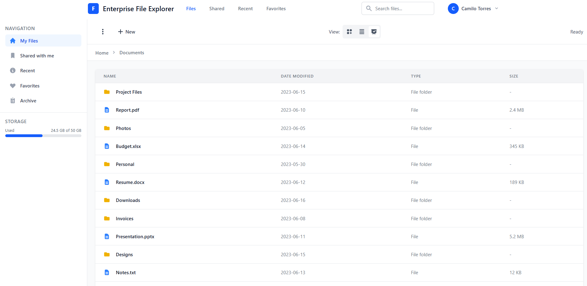
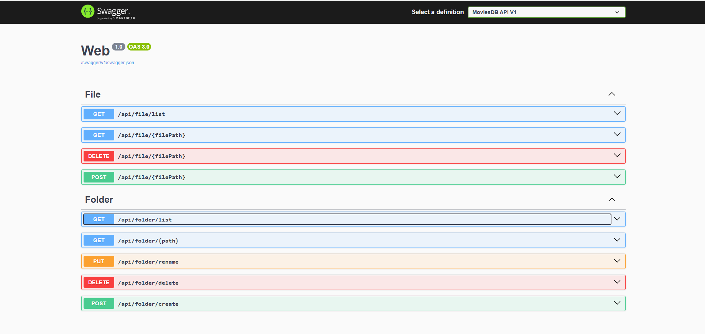

<h1 align="center">File-Explorer 📂</h1>

  <strong>Un explorador de archivos simple y potente, desarrollado para ofrecer una gestión de archivos y directorios intuitiva y eficiente.</strong>

  
  

## Tabla de Contenidos

*   [Descripción General](#descripción-general)
*   [Características Principales](#características-principales)
*   [Vistazo a la Aplicación](#vistazo-a-la-aplicación)
*   [Tecnologías Utilizadas](#tecnologías-utilizadas)
*   [Arquitectura del Proyecto](#arquitectura-del-proyecto)
*   [Patrones de Diseño Utilizados](#patrones-de-diseño-utilizados)
*   [Prerrequisitos](#prerrequisitos)
*   [Instalación](#instalación)
*   [Uso](#uso)
*   [Roadmap (Funcionalidades Futuras)](#roadmap-funcionalidades-futuras)
*   [Contribuciones](#contribuciones)
*   [Licencia](#licencia)
*   [Contacto](#contacto)

## Descripción General

File-Explorer es una aplicación de escritorio moderna que permite a los usuarios navegar por el sistema de archivos, visualizar el contenido de los directorios y realizar operaciones esenciales con archivos y carpetas. La interfaz de usuario está construida con Angular, proporcionando una experiencia fluida y reactiva, mientras que la lógica del backend se maneja con .NET Core, asegurando robustez y rendimiento.

## Características Principales

*   ✅ **Navegación Intuitiva:** Explore su sistema de archivos con una estructura de árbol de directorios clara y fácil de usar.
*   ✅ **Visualización Detallada:** Vea el contenido de las carpetas, incluyendo detalles de archivos y previsualizaciones (si aplica).
*   ⏳ **Operaciones Básicas de Archivos:**
    *   Copiar archivos/carpetas
    *   Pegar archivos/carpetas
    *   Renombrar archivos/carpetas
    *   Eliminar archivos/carpetas
    *   Crear nuevas carpetas
    *   Búsqueda de archivos
    *   *(Más características se añadirán progresivamente)*

## Vistazo a la Aplicación

  
   
  <em>Navegación de carpetas en File-Explorer.</em>

  
   
  <em>Documentación de la API con Swagger.</em>

## Tecnologías Utilizadas

*   **Frontend:** [Angular](https://angular.io/)
*   **Backend:** [.NET Core](https://dotnet.microsoft.com/)

## Arquitectura del Proyecto

El proyecto sigue una arquitectura por capas (Layered Architecture), comúnmente asociada con los principios de la Arquitectura Limpia (Clean Architecture). Esta separación de responsabilidades se evidencia en la estructura del proyecto con las siguientes capas principales:

*   **Web (Capa de Presentación):** Responsable de manejar las solicitudes HTTP, la interfaz de usuario (frontend con Angular) y la API (backend con .NET Core).
*   **Application (Capa de Aplicación):** Contiene la lógica de negocio y los casos de uso de la aplicación. Orquesta las interacciones entre la capa de presentación y la capa de infraestructura.
*   **Infrastructure (Capa de Infraestructura):** Se encarga de las implementaciones concretas de las abstracciones definidas en la capa de aplicación, como el acceso a datos, servicios externos, etc.
*   **Domain (Capa de Dominio):** Contiene las entidades y las reglas de negocio de la aplicación.

## Patrones de Diseño Utilizados
2nibilidad y testabilidad. Se observa en la configuración de servicios en `Program.cs`.
*   **Model-View-Controller (MVC) / API Controllers:** El backend utiliza controladores para gestionar las solicitudes HTTP y las respuestas, siguiendo un patrón similar a MVC para las APIs.
*   **Component-Based Architecture:** El frontend (Angular) está construido utilizando componentes reutilizables, un pilar fundamental de Angular.
*   **Repository Pattern (probable):** Aunque no se ha inspeccionado directamente el código de la capa de infraestructura, es común que en arquitecturas de este tipo se utilice el patrón Repository para abstraer el acceso a datos.
*   **Service Pattern (probable):** La capa de aplicación suele implementar servicios que encapsulan la lógica de negocio.

- - -

# Implementacions faltantes
- Faltaria agregar el token refresh
- Bloquear la cuenta de usuarioa cuando haya fallado los intentos de iniciar sesion
- 