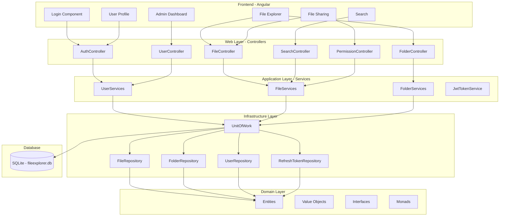

# File-Explorer Project Completion Plan

## Executive Summary

This document provides a comprehensive analysis of the File-Explorer project and a detailed plan to complete all missing functionality. The project is a file management platform built with .NET Core (backend) and Angular (frontend), following a Clean Architecture pattern with Domain, Application, Infrastructure, and Web layers.

---

## Current Project Status: ~40% Complete

### What's Working
- User authentication (login/register) with JWT
- User profile management
- Refresh token mechanism
- Basic project structure and architecture
- Database context and migrations
- CORS and rate limiting configuration
- Angular frontend with routing and guards

### What's Incomplete or Missing

---

## 1. FILE SERVICES (Critical - 0% Complete)

**Location:** `src/Application/Services/FIleServices.cs`

**Current State:** Most methods throw `NotImplementedException`

**Methods to Implement:**
| Method | Status | Description |
|--------|--------|-------------|
| `GetFiles(string path)` | Partial | Returns files from repository |
| `ReadFile(string filePath)` | Partial | Reads file content |
| `GetFileByIdAsync(Guid id)` | Not Implemented | Get single file by ID |
| `UploadFileAsync(IFormFile, Guid?)` | Partial | Upload with persistence |
| `DownloadFileAsync(Guid id)` | Not Implemented | Download file with stream |
| `DeleteFileAsync(Guid id)` | Not Implemented | Soft/hard delete file |
| `CreateShareLinkAsync(Guid, ShareFileRequest)` | Not Implemented | Generate shareable links |
| `CreateFileAsync(CreateFileRequest)` | Not Implemented | Create file record |

**Dependencies Needed:**
- `IFileRepository` with full CRUD operations
- File metadata storage in database
- Physical file storage management

---

## 2. FOLDER SERVICES (Critical - 0% Complete)

**Location:** `src/Application/Services/FolderServices.cs`

**Current State:** All methods throw `NotImplementedException`. Commented-out code shows intended logic.

**Methods to Implement:**
| Method | Status | Description |
|--------|--------|-------------|
| `GetSubFolders(string path)` | Not Implemented | Get subdirectories |
| `GetFiles(string path)` | Not Implemented | Get files in path |
| `ReadFile(string filePath)` | Not Implemented | Read file content |
| `CreateFolder(string path)` | Not Implemented | Create directory |
| `RenameFolder(string oldPath, string newPath)` | Not Implemented | Rename directory |
| `DeleteFolder(string path)` | Not Implemented | Delete directory |
| `GetFolderByIdAsync(Guid id)` | Not Implemented | Get folder by ID |
| `GetFolderContentsAsync(Guid id)` | Not Implemented | Get folder + files |
| `CreateFolderAsync(CreateFolderRequest)` | Not Implemented | Create with DB persistence |
| `UpdateFolderAsync(Guid, UpdateFolderRequest)` | Not Implemented | Update folder metadata |
| `DeleteFolderAsync(Guid id)` | Not Implemented | Delete from DB |
| `MoveFolderAsync(Guid, Guid)` | Not Implemented | Move to parent folder |

**Key Issues:**
- User authentication context not resolved (commented out `GetAuthenticatedUserId()`)
- Storage path resolution not implemented
- No database integration for folder operations

---

## 3. USER SERVICES (High Priority - 80% Complete)

**Location:** `src/Application/Services/UserServices.cs`

**Methods to Implement:**
| Method | Status | Description |
|--------|--------|-------------|
| `RevokeAuthenticationAsync(string)` | Not Implemented | Logout/revoke token |
| `AuthenticateWithGoogleAsync(string)` | Not Implemented | OAuth2 Google login |
| Password reset email sending | Not Implemented | Email service integration |

**Notes:** Core authentication, registration, profile update, and password reset logic are implemented.

---

## 4. SEARCH CONTROLLER (Medium Priority - 0% Complete)

**Location:** `src/Web/Controllers/SearchController.cs`

**Current State:** Returns empty results with TODO comments

**To Implement:**
- Full-text search across files and folders
- Advanced search with filters (type, date, size)
- Search suggestions/autocomplete
- Pagination support
- Integration with database queries

---

## 5. PERMISSION CONTROLLER (Medium Priority - 0% Complete)

**Location:** `src/Web/Controllers/PermissionController.cs`

**Current State:** Returns empty/mock responses with TODO comments

**To Implement:**
- File permission model (read, write, admin)
- Folder permission model
- Grant/revoke permission logic
- Permission inheritance (folder -> children)
- User/group-based permissions

---

## 6. DATABASE ENTITIES (High Priority - Missing Entities)

**Current Entities:**
- `User` - Complete
- `RefreshToken` - Complete
- `FileSystemItem` (abstract base) - Complete
- `FileItem` - Partial (missing metadata)
- `FolderItem` - Partial (missing metadata)

**Missing Entities:**
| Entity | Purpose | Fields Needed |
|--------|---------|---------------|
| `FileShare` | Shared file links | Id, FileId, SharedByEmail, SharedWithEmail, Permission, ExpiresAt, Token |
| `Permission` | Access control | Id, UserId, FileId/FolderId, PermissionType, GrantedAt, GrantedBy |
| `ActivityHistory` | Audit trail | Id, UserId, Action, TargetId, TargetType, Timestamp, Details |
| `Notification` | User notifications | Id, UserId, Message, Type, IsRead, CreatedAt |
| `Group` | User groups | Id, Name, Description, CreatedAt |
| `GroupMember` | Group membership | GroupId, UserId, Role |

---

## 7. REPOSITORIES (High Priority)

**Current Repositories:**
- `UserRepository` - Partial
- `FileRepository` - Partial
- `FolderRepository` - Partial
- `RefreshTokenRepository` - Partial

**Missing Repository Methods:**
- File CRUD operations with metadata
- Folder tree navigation
- Search queries (full-text, filtered)
- Permission queries
- Activity history queries
- Soft delete with trash recovery

---

## 8. FRONTEND INTEGRATION (Medium Priority)

**Current State:** Angular components exist but use mock data

**To Implement:**
| Component | Backend Integration Needed |
|-----------|---------------------------|
| File Explorer | File/folder CRUD, upload, download |
| File Sharing | Share link creation, permission management |
| Search | Search API integration |
| Activity History | Activity log API |
| Admin Users | User management API |
| Trash Bin | Soft delete recovery API |
| Notifications | Notification API |
| Storage | Storage usage API |

---

## 9. ADDITIONAL MISSING FEATURES

### Email Service Integration
- Password reset emails
- Share notification emails
- Account verification emails

### File Versioning
- Track file versions
- Restore previous versions

### Trash/Recycle Bin
- Soft delete implementation
- Restore from trash
- Permanent delete
- Auto-cleanup after retention period

### Storage Quota Management
- Track user storage usage
- Enforce quota limits
- Storage upgrade/downgrade

### Audit/Activity Logging
- Log all file operations
- Track user actions
- Activity history API

---

## Architecture Diagram



---

## Implementation Priority Order

### Phase 1: Core File Operations (Critical)
1. Complete FileRepository with all CRUD operations
2. Complete FolderRepository with all CRUD operations
3. Implement FileServices methods
4. Implement FolderServices methods
5. Update FileController and FolderController

### Phase 2: User Features (High Priority)
6. Implement RevokeAuthenticationAsync
7. Add email service integration
8. Complete password reset flow

### Phase 3: Search & Permissions (Medium Priority)
9. Implement search functionality
10. Add permission entities and repositories
11. Implement permission controller

### Phase 4: Advanced Features (Medium Priority)
12. Add activity history tracking
13. Implement trash/recycle bin
14. Add storage quota management
15. Implement file sharing with links

### Phase 5: Frontend Integration (Medium Priority)
16. Connect Angular components to backend APIs
17. Add real-time notifications
18. Implement file upload UI

### Phase 6: Testing & Documentation (Low Priority)
19. Add integration tests
20. Update API documentation
21. Add user documentation

---

## Recommended Technology Additions

| Technology | Purpose |
|------------|---------|
| MailKit/FluentEmail | Email sending |
| Google.Apis.Auth | Google OAuth |
| Lucene.NET or Elasticsearch | Full-text search |
| Serilog.Sinks.Email | Email logging |
| xUnit + Moq | Testing framework |

---

## File Structure Changes Needed

```
src/
├── Domain/
│   ├── Entities/
│   │   ├── FileShare.cs          [NEW]
│   │   ├── Permission.cs         [NEW]
│   │   ├── ActivityHistory.cs    [NEW]
│   │   ├── Notification.cs       [NEW]
│   │   └── Group.cs              [NEW]
│   └── Interfaces/
│       ├── IFileShareRepository.cs    [NEW]
│       ├── IPermissionRepository.cs   [NEW]
│       └── IActivityRepository.cs     [NEW]
│
├── Application/
│   ├── Services/
│   │   ├── FileServices.cs       [COMPLETE]
│   │   ├── FolderServices.cs     [COMPLETE]
│   │   ├── SearchServices.cs     [NEW]
│   │   └── EmailService.cs       [NEW]
│   └── DTOs/
│       ├── Request/
│       │   ├── ShareFileRequest.cs
│       │   └── SearchRequest.cs
│       └── Response/
│           ├── FileResponse.cs
│           └── FolderResponse.cs
│
└── Infrastructure/
    ├── Repositories/
    │   ├── FileShareRepository.cs    [NEW]
    │   ├── PermissionRepository.cs   [NEW]
    │   └── ActivityRepository.cs     [NEW]
    └── Services/
        └── EmailService.cs          [NEW]
```

---

## Next Steps

1. Review and approve this completion plan
2. Switch to Code mode to begin implementation
3. Start with Phase 1: Core File Operations
4. Progress through phases systematically
